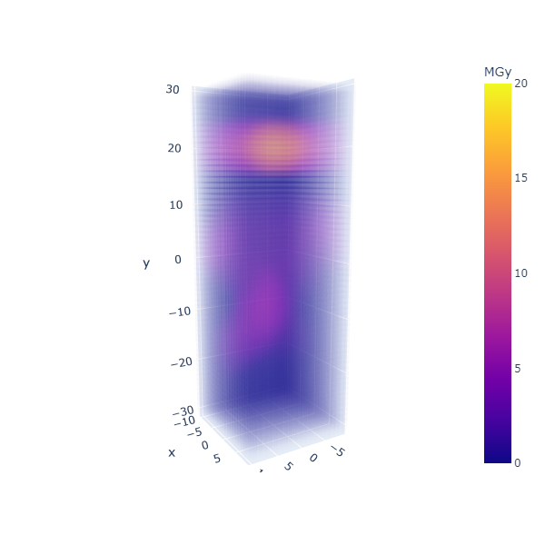

# RADDOSE-3D python wrapper
A python wrapper for the RADDOSE-3D Java application from the Garman Lab at the University of Oxford.

From their [Github page](https://github.com/GarmanGroup/RADDOSE-3D):
>RADDOSE-3D allows the macroscopic modelling of an X-ray diffraction experiment for the purpose of better predicting radiation-damage progression. The distribution of dose within the crystal volume is calculated for a number of iterations in small angular steps across one or more data collection wedges, providing a time-resolved picture of the dose state of the crystal. The code is highly modular so that future contributions from the community can be easily integrated into it, in particular to incorporate online methods for determining the shape of macromolecular crystals and better protocols for imaging real experimental X-ray beam profiles.

## Usage
See [PDF for command reference and manual](RADDOSE-3D-user-guide.pdf) and [examples/mx_example.py](examples/mx_example.py) for a python script with reasonable settings. In the same folder are scripts for running RADDOSE-3D asynchronously and via Prefect.

## Output
Name-Summary.txt contains a brief description of the analysis and a breakdown of salient stats. The most relevant lines to scan are "Average Dose (95% of total absorbed energy threshold)" and the "Final Dose Histogram". For a full treatment of what the results mean refer to the references, ["An in-depth discussion of the output"](#1) in particular.

### Plotting the output
The name-DoseState.csv file contains the end result of the analysis with each voxel given a dose count. Plotting this can be helpful to understand the RADDOSE-3D syntax for translating the crystal in the beam, offsetting the rotation axis, or doing helical data collection.

For example:

```
import pandas as pd
import plotly.express as px

df = pd.read_csv('my_sample/my_sample-DoseState.csv',
                 names=['x','y','z','MGy','_','__'],
                 )

df.drop(['_','__'], axis=1, inplace=True)

fig = px.scatter_3d(
    df,
    x='z',
    y='x',
    z='y',
    color='MGy',
    opacity=0.010,
    symbol_sequence=['square'],
    range_color=[0,20],
    width=600,
    height=600,
    )

fig.show()
```

Which would come out like:



## References
###### The original RADDOSE-3D publication
Zeldin, O. B., Gerstel, M., & Garman, E. F. (2013). RADDOSE-3D : time- and space-resolved modelling of dose in macromolecular crystallography. Journal of Applied Crystallography, 46, 1225–1230. https://doi.org/10.1107/S0021889813011461

###### An in-depth discussion of the output {#1}
Zeldin, O. B., Gerstel, M., & Garman, E. F. (2013).Optimizing the spatial distribution of dose in X-ray macromolecular crystallography.J. Synchrotron Rad. (2013). 20, 49–57. https://doi.org/10.1107/S0909049512044706

###### A new publication on updates to RADDOSE-3D in the period 2014 - 2017
Bury, C. S., Brooks‐Bartlett, J. C., Walsh, S. P. and Garman, E. F. (2018), Estimate your dose: RADDOSE‐3D. Protein Science, 27, 217-228. https://doi.org/10.1002/pro.3302
